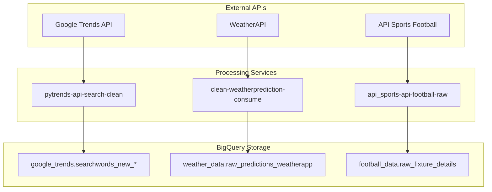

# AI23 Data Engineering Project

A comprehensive data pipeline system for Swedish market analytics, implementing containerized microservices for collecting, processing, and analyzing data from various external APIs with machine learning capabilities.

[](https://deepwiki.com/FutureGoose/ai23_data_engineering_project)

## 🏗️ Architecture Overview

The system consists of four main processing domains deployed on Google Cloud Platform:

- **Google Trends Pipeline** - Swedish keyword search trends analysis
- **Weather Prediction ML Pipeline** - XGBoost-powered weather forecasting for Stockholm  
- **Football Analytics Pipeline** - Match statistics and fixture data collection
- **Weather Data Ingestion** - Multi-source weather data collection (WeatherAPI, SMHI)

## 🚀 Key Features

### Google Trends Analytics [1](#0-0) 

- **Swedish Market Focus**: Localized data collection for Stockholm region (`geo='SE-AB'`)
- **Themed Keyword Categories**: Fashion, Food, Beverages, Weather gear
- **Robust Retry Logic**: 10 retry attempts with exponential backoff
- **Character Normalization**: Handles Swedish characters (å, ä, ö) for BigQuery compatibility

### Weather Prediction ML [2](#0-1) 

- **XGBoost Model**: Trained on 20 years of Stockholm weather data (2004-2024)
- **High Accuracy**: MAE: 1.43°C, RMSE: 1.89°C
- **Feature Engineering**: Temporal and lag features for improved predictions
- **Real-time Inference**: FastAPI endpoints for live weather forecasting

### Football Analytics [3](#0-2) 

- **API Sports Integration**: Fixture details and match statistics
- **Rate Limiting**: Intelligent throttling to respect API quotas
- **Flexible Storage**: JSON document storage for comprehensive match data

## 🛠️ Technology Stack

- **Runtime**: Python 3.x with FastAPI
- **ML Framework**: XGBoost for weather prediction
- **Data Storage**: Google BigQuery
- **Container Platform**: Google Cloud Run
- **Orchestration**: Google Workflows
- **CI/CD**: GitHub Actions
- **APIs**: Google Trends, WeatherAPI, SMHI, API Sports

## 📊 Data Flow



## 🚀 Deployment

### Prerequisites
- Google Cloud Platform account with BigQuery and Cloud Run enabled
- GitHub repository with Actions enabled
- Service account with appropriate permissions

### Automated Deployment [4](#0-3) 

Each service deploys automatically via GitHub Actions when changes are pushed to the `main` branch:

- **Path-based Triggers**: Only affected services redeploy
- **Regional Deployment**: `europe-north1` for European data residency
- **Container Registry**: `gcr.io/team-god/` namespace

### Service Configuration
- **Concurrency**: 2 requests per instance
- **Authentication**: Unauthenticated access for workflow orchestration
- **Monitoring**: Comprehensive logging with error details

## 📈 Performance Metrics

### Weather ML Model
- **Training Data**: 183,817 records spanning 20 years
- **Features**: 7 engineered features including lag variables
- **Target**: Maximum temperature prediction for next 24 hours
- **Accuracy**: MAE 1.43°C, RMSE 1.89°C

### Data Processing
- **Google Trends**: 4 themed keyword categories with retry mechanisms
- **Football Data**: Rate-limited collection (60s pause every 10 requests)
- **Weather Prediction**: Real-time inference with feature validation

## 🔧 Development

### Local Setup
```bash
# Clone repository
git clone https://github.com/FutureGoose/ai23_data_engineering_project.git

# Install dependencies for specific service
cd pipes/[service-name]
pip install -r requirements.txt

# Run service locally
uvicorn src.main:app --host 0.0.0.0 --port 8080
```

### Service Structure
Each pipeline follows a consistent structure:
- `src/main.py` - FastAPI application with endpoints
- `Dockerfile` - Container build configuration  
- `requirements.txt` - Python dependencies
- Corresponding workflow YAML in `pipelines/`

## 📝 API Endpoints

### Weather Prediction Service
- `GET /` - Full prediction pipeline execution
- `GET /predict` - Generate weather predictions
- `GET /bigquery_test` - Fetch sample data

### Google Trends Service  
- `GET /` - Fetch and store trends data for all keyword categories

### Football Analytics Service
- `GET /` - Collect fixture details and statistics

## 🏢 Project Context

This project was developed as part of the AI23 Data Engineering curriculum, demonstrating enterprise-grade data pipeline implementation with:

- **Microservices Architecture**: Independent, scalable services
- **Cloud-Native Design**: Leveraging Google Cloud Platform capabilities  
- **ML Integration**: Production machine learning workflows
- **Swedish Market Focus**: Localized data collection and analysis

---

**Contributors**: FutureGoose, speedan, danhag123, Gustaf Bodén  
**License**: MIT  
**Documentation**: See individual service directories for detailed implementation notes

## Notes

The system implements sophisticated error handling and retry mechanisms across all services, with particular attention to API rate limiting and Swedish character encoding issues. The weather prediction pipeline represents the most complex component, combining data engineering with machine learning for real-time inference capabilities.

Wiki pages you might want to explore:
- [Data Pipelines (FutureGoose/ai23_data_engineering_project)](/wiki/FutureGoose/ai23_data_engineering_project#2)
- [Weather Prediction ML Pipeline (FutureGoose/ai23_data_engineering_project)](/wiki/FutureGoose/ai23_data_engineering_project#2.2.3)